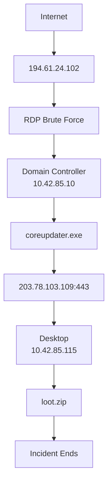
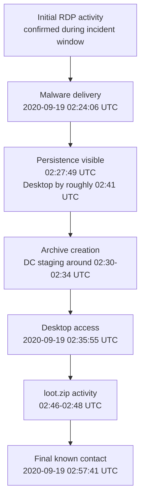

<!-- markdownlint-disable MD013 -->

# The Stolen Szechuan Sauce: A Connor DFIR Walkthrough

Title: The Stolen Szechuan Sauce: A Connor DFIR Walkthrough
Summary: A public, spoiler-heavy walkthrough of DFIR Madness Case 001 showing a full analyst workflow from intake and preservation through network, host, memory, disk, malware, and final answer alignment.
Tags: DFIR, incident response, memory forensics, PCAP analysis, Windows forensics, malware analysis, super timeline, DFIR Madness, walkthrough
Source attribution: Based on DFIR Madness Case 001 and the official follow-on training posts. Structure inspired by the DFIR Madness walkthrough series for PCAP, memory, disk triage, timing, and super timeline analysis, but all prose and conclusions here are original to this writeup.

## Executive Summary

| Category | Finding |
| --- | --- |
| Initial Access | RDP brute force led to successful external RDP access to the domain controller. |
| Malware | `coreupdater.exe` was delivered from `194.61.24.102` and matched Meterpreter-family second-stage behavior. |
| Persistence | Persistence was directly proven on both systems through a DC service and desktop Run-key plus registry-backed payload storage. |
| Lateral Movement | The desktop was later accessed from the DC using the compromised administrator context. |
| Data Staging | `Secret.zip` on the DC and `loot.zip` on the desktop were staged and later deleted. |
| Command & Control | Callback behavior matched decoded loader logic communicating with `203.78.103.109:443`. |
| Overall Confidence | Compromise, staging, and file access are directly proven; final exfiltration remains unresolved in the preserved artifacts. |

An external adversary targeted the exposed domain controller with repeated RDP activity, obtained interactive access, and then delivered `coreupdater.exe` from `194.61.24.102`. The recovered malware established persistence, matched Meterpreter-family behavior, and called back to `203.78.103.109:443`. From the domain controller foothold, the adversary later accessed the desktop, deployed the same malware there, and created short-lived archive files including `Secret.zip` and `loot.zip`. The preserved artifacts directly prove compromise, malware deployment, persistence, lateral movement, file access, and local staging. They strongly support theft, but the final exfiltration path was not equally preserved for every staged archive.

## Table Of Contents

- [Introduction](#introduction)
- [Learning Objectives](#learning-objectives)
- [Scope and Evidence](#scope-and-evidence)
- [Tools and Artifacts](#tools-and-artifacts-used)
- [Methodology](#methodology)
- [Timeline and Timezone Handling](#timeline-and-timezone-handling)
- [Network Analysis](#network-analysis)
- [Host and Log Correlation](#host-and-log-correlation)
- [Malware Analysis](#malware-analysis)
- [Data Access, Staging, and Exfiltration](#data-access-staging-and-exfiltration)
- [Answers to the Lab Questions](#answers-to-the-lab-questions)
- [Bonus Questions](#bonus-questions)
- [Score and Lessons Learned](#score-and-lessons-learned)
- [Investigation Summary](#investigation-summary)
- [Conclusion](#conclusion)
- [Attribution](#attribution)

## Attack Flow Diagram



## Introduction

This walkthrough covers DFIR Madness Case 001, "The Stolen Szechuan Sauce," as worked end to end in a DFIR workstation workflow.

Original lab prompt: [DFIR Madness Case 001 brief](https://dfirmadness.com/the-stolen-szechuan-sauce/)

Official answer key: [DFIR Madness Case 001 answer key](https://dfirmadness.com/answers-to-szechuan-case-001/)

Referenced walkthrough structure for study order and article shape:

- PCAP analysis: [DFIR Madness PCAP walkthrough](https://dfirmadness.com/case-001-pcap-analysis/)
- Memory analysis: [DFIR Madness memory walkthrough](https://dfirmadness.com/case-001-memory-analysis/)
- Disk triage: [DFIR Madness disk triage walkthrough](https://dfirmadness.com/triage-disk-analysis-case-001/)
- Timing and time correction: [DFIR Madness timing guide](https://dfirmadness.com/case-001-the-timing-of-it-all/)
- Super timeline analysis: [DFIR Madness super timeline guide](https://dfirmadness.com/case-001-super-timeline-analysis/)

The lab mixes two different goals:

- build a defensible incident narrative from the artifacts
- answer a fixed set of lab questions directly and cleanly

That split matters. A strong incident report can still lose points if the final answer sheet does not map each conclusion back to the exact question that asked for it.

This walkthrough is written to show both the investigation flow and the final question-by-question alignment.

> [!IMPORTANT]
> **Key Takeaway**
> This writeup is structured to do two jobs at once: preserve a defensible investigative narrative and answer the lab prompt directly. The rest of the report keeps those goals aligned without changing the underlying evidence.

## Spoiler Notice

This writeup contains spoilers for the entire lab, including initial access, malware, lateral movement, staging, and likely exfiltration behavior.

## Learning Objectives

By the end of this walkthrough, an analyst should be able to:

- explain why PCAP triage was the fastest first lane in this case
- correlate external RDP activity with host logs and later host artifacts
- use memory findings to pivot into disk, registry, and timeline evidence
- separate accessed, staged, deleted, and exfiltrated states instead of collapsing them into one theft claim
- normalize network time, scenario time, and host-local time when the endpoint timezone is wrong
- distinguish directly proven, strongly supported, reconstructed, and unresolved conclusions in the final writeup

> [!IMPORTANT]
> **Key Takeaway**
> The investigative value in this case came from disciplined pivots, time normalization, and careful confidence handling. Those themes drive every section that follows.

## Scope And Evidence

Artifact categories reviewed in this case:

- edge PCAP
- E01 disk images for the domain controller and desktop
- protected files and registry hives
- memory images
- pagefiles
- autoruns outputs
- Windows event logs
- registry hives and registry-derived persistence artifacts
- malware artifacts carved from host and network evidence

Sanitized relative examples of reviewed material:

- `case/evidence/case001.pcap`
- `case/evidence/citadeldc01.mem`
- `case/evidence/DESKTOP-SDN1RPT.mem`
- `case/evidence/E01-DC01/...`
- `case/evidence/DESKTOP-E01/...`
- `case/evidence/Protected Files/...`
- `case/exports/...`

This public writeup does not embed raw evidence, full logs, full malware samples, full archive hashes, or host-specific local filesystem paths.

> [!IMPORTANT]
> **Key Takeaway**
> The writeup is evidence-led but intentionally sanitized for public release. It preserves the investigative logic without exposing raw case material.

## Tools And Artifacts Used

Primary tools and outputs used during the investigation:

- Zeek and PCAP summaries for network triage
- Wireshark and tcpdump-style filtering for packet pivots
- Windows event log parsing for Terminal Services, Security, and related logs
- Volatility-based memory review for sockets, process state, and persistence clues
- registry review for timezone and persistence
- disk and timeline residue for staging, deletion, and file access
- malware triage of `coreupdater.exe`, decoded shellcode, and stage-two residue
- tracker-driven answer alignment for final question coverage

Representative workflow commands and patterns:

```bash
./scripts/analyze-current-pcap.sh /path/to/case001.pcap
./scripts/analyze-current-memory.sh /path/to/DESKTOP-SDN1RPT.mem
./scripts/generate-current-report.sh --case /path/to/Szechuan-Sauce-Incident
```

```bash
tcpdump -nttttr case001.pcap 'tcp port 3389 and (dst net 10.42.85.0/24 and not src net 10.42.85.0/24)'
```

```bash
log2timeline.py --parsers="winevtx,usnjrnl,prefetch,winreg,esedb/srum" targeted.dump image.E01
psort.py targeted.dump --output_time_zone "UTC" -o L2tcsv -w targeted.csv
```

```bash
vol.py -f image.mem --profile=Win2012R2x64 netscan
vol.py -f image.mem --profile=Win2012R2x64 malfind
vol.py -f image.mem --profile=Win2012R2x64 pstree -v
```

> [!IMPORTANT]
> **Key Takeaway**
> The toolset was broad, but each tool served a specific pivot purpose: network reduction, host confirmation, malware characterization, or timeline reconstruction. The commands below remain unchanged because they are part of the investigative record.

## Methodology

### Analysis Order

The case was worked in this order:

1. intake and preservation
2. PCAP and network triage
3. host log correlation
4. memory review
5. disk and registry review
6. malware analysis
7. timeline reconstruction
8. final answer-sheet alignment

### Why Network Triage Came First

PCAP triage came first because it offered the fastest path to high-signal pivots:

- a suspicious external source
- an externally exposed service
- a likely intrusion method
- malware delivery over HTTP
- callback infrastructure
- a second internal host of interest

That early reduction mattered. Instead of treating the disk images or memory images as the entry point, the network lane quickly identified:

- `194.61.24.102` as the external adversary system of interest
- `203.78.103.109` as callback infrastructure
- `coreupdater.exe` as the delivery filename
- `10.42.85.10` and `10.42.85.115` as the most relevant internal systems

Those pivots then made every later lane faster.

### Pivot Logic Across Lanes

The workflow repeatedly moved from one artifact class to another:

- PCAP to logs: confirm whether suspicious RDP traffic became a real authenticated session
- PCAP to malware: carve or recover the delivered payload and inspect it
- malware to memory: look for the callback IP and injected process behavior in memory
- memory to disk: turn process names and file paths into disk pivots
- disk to timeline: use filenames, archive names, and event windows to reconstruct staging and deletion
- timeline back to prompt answers: decide what is directly proven, what is reconstructed, and what remains unresolved

> [!IMPORTANT]
> **Key Takeaway**
> The investigative flow was deliberate: start with the fastest artifact for pivots, then move lane by lane to confirm, constrain, and explain. That sequencing is a major reason the final conclusions stayed defensible.

## Timeline And Timezone Handling

This lab has a deliberate timing trap, and it is worth calling out explicitly.

The scenario states Colorado in September 2020, which means the expected scenario time is UTC-6. The network capture infrastructure was aligned to that reality.

The host systems, however, were configured to Pacific time, which introduced a one-hour mismatch in host-derived artifacts.

### Timeline Overview



The chart above uses only timestamps already stated elsewhere in the report. The initial RDP node remains untimed because this public writeup does not assign it a single normalized timestamp.

### Time Bases Used In This Walkthrough

| Time category | Meaning | How it was handled |
| --- | --- | --- |
| Normalized UTC | Final cross-source reporting time | Used as the primary time base in this walkthrough |
| Scenario or victim-local time | What the incident should have been in Colorado | Treated as UTC-6 for September 2020 |
| Endpoint-configured timezone | What the host was set to | Incorrectly set to Pacific, effectively pushing host telemetry one hour ahead |
| PCAP or router time | Network telemetry time | Treated as the correct anchor for hour-level alignment |

### Practical Effect

If a host artifact appeared to show an event at 03:22 UTC while the network telemetry showed the same cluster at 02:22 UTC, the network side was treated as the correct hour and the host side was normalized accordingly.

That mismatch is not a trivial footnote. It affects:

- RDP timing
- malware execution windows
- file staging windows
- lateral movement correlation
- final answer-sheet timestamps

### Final Normalization Rule

This walkthrough uses normalized UTC in the narrative and tables, while explicitly calling out when host artifacts were observed in the shifted hour.

Helpful commands for this section:

```bash
psort.py dc01-super.dump --output_time_zone "UTC" -o L2tcsv -w dc01-super-timeline.csv
```

```bash
Get-WinEvent -Path .\Security.evtx -Oldest | Select-Object -First 5 TimeCreated, Id
```

Recovered timezone configuration showed the endpoint set to Pacific time even though the scenario should be interpreted in Colorado local time:

```text
Server local time configuration
- Pacific Standard Time with daylight saving active
- Bias = 480
- ActiveTimeBias = 420
```

> [!IMPORTANT]
> **Key Takeaway**
> Timeline work in this case depended on treating timezone configuration as evidence, not background metadata. Normalized UTC kept the narrative consistent across PCAP, host logs, and staged-file activity.

## Network Analysis

### External RDP Activity

The network lane established the initial intrusion story quickly.

What the PCAP directly showed:

- an external host, `194.61.24.102`, probing the victim environment
- heavy RDP traffic to `10.42.85.10`
- HTTP delivery of `coreupdater.exe` from `194.61.24.102`
- callback traffic from infected internal hosts to `203.78.103.109:443`

The most important network conclusion was not merely that there was RDP traffic. It was that the traffic pattern supported both a brute-force attempt and a later successful interactive session.

### Why This Was Promoted As RDP Brute Force

This is stronger than saying "an external RDP logon occurred." The supporting pattern was:

- high-frequency repeated inbound attempts to TCP 3389
- repeated failed authentication behavior in host telemetry
- a later successful RDP session tied to the same external IP
- follow-on host activity that would not exist without interactive access

That combination is sufficient to say RDP brute force plus successful access, not merely generic external RDP exposure.

### Malicious Infrastructure Versus Background Traffic

Two IPs were promoted as malicious infrastructure:

- `194.61.24.102` as the external entry and payload-delivery host
- `203.78.103.109` as callback infrastructure

Some additional Microsoft or CDN-looking destinations appeared in memory and general traffic. Those were not promoted to malicious infrastructure because the preserved evidence fit ordinary operating system, browser, telemetry, or content delivery behavior better than standalone attacker infrastructure.

Helpful commands for this section:

```bash
tcpdump -nttttr case001.pcap 'tcp port 3389 and (dst net 10.42.85.0/24 and not src net 10.42.85.0/24)'
```

```bash
tcpdump -nttttr case001.pcap 'host 194.61.24.102'
```

Additional direct network findings retained from the original working notes:

- Zeek `conn.log` and `rdp.log` directly prove sustained external RDP activity from `194.61.24.102` to `10.42.85.10:3389` during the incident window.
- The PCAP directly preserves attacker-served delivery of `/coreupdater.exe` from `194.61.24.102` to both `10.42.85.10` and `10.42.85.115`, followed by callback traffic to `203.78.103.109:443` that matches the decoded loader behavior.

> [!IMPORTANT]
> **Key Takeaway**
> The network evidence established both the intrusion path and the malware infrastructure early. That let later host and malware work focus on confirmation instead of open-ended searching.

## Host And Log Correlation

The next step was proving that suspicious network traffic turned into real host activity.

### Domain Controller RDP Confirmation

Recovered Terminal Services logs on the domain controller directly proved:

- successful external RDP authentication
- RDP session logon
- shell start
- later disconnect activity

That is important because it upgrades the network story from probable to directly proven for the DC compromise.

### Desktop-To-DC Correlation

Later in the incident, logs and network evidence directly showed the desktop interacting with the DC as `Administrator/C137.LOCAL` and performing privileged operations including:

- LDAP binds
- SMB mappings
- DCE/RPC activity such as `LsarLookupNames4`, `DRSBind`, `DRSCrackNames`, `NetrLogonGetDomainInfo`, and `bkrp_BackupKey`

That is enough to directly prove meaningful desktop-origin privileged DC interaction. It is not enough, on its own, to prove a full DCSync-style replication read.

### Log Limits

The log record was strong but incomplete:

- `Security.evtx` on the DC ended before some of the most important late-window events
- recovered desktop SMB client logs added little value for the archive-staging window
- DC logs did not directly prove where `Secret.zip` or `loot.zip` went after local staging

That matters because it explains why some final claims stay in the strongly supported or unresolved bucket rather than the directly proven bucket.

Helpful commands for this section:

```bash
Get-WinEvent -Path .\Microsoft-Windows-TerminalServices-RemoteConnectionManager%4Operational.evtx -Oldest | Select-Object TimeCreated, Id, Message
```

```bash
Get-WinEvent -Path .\Security.evtx -Oldest |
  Where-Object { $_.Id -in 4624, 4768, 4769 } |
  Sort-Object TimeCreated
```

Additional direct log findings retained from the original working notes:

- Recovered `Microsoft-Windows-TerminalServices-RemoteConnectionManager%4Operational.evtx` directly proves successful RDP authentication from `194.61.24.102`.
- Recovered `Microsoft-Windows-TerminalServices-LocalSessionManager%4Operational.evtx` directly proves `C137\Administrator` session logon, shell start, and disconnect activity during the external RDP window.
- Zeek `kerberos.log`, `ldap.log`, `smb_mapping.log`, and `dce_rpc.log` directly prove `10.42.85.115` authenticating to the domain controller as `Administrator/C137.LOCAL`, performing LDAP SASL binds, mapping `IPC$`, `NETLOGON`, and `sysvol`, and invoking `LsarLookupNames4`, `DRSBind`, repeated `DRSCrackNames`, `NetrLogonGetDomainInfo`, and `bkrp_BackupKey`.

> [!IMPORTANT]
> **Key Takeaway**
> Host logs converted the network story into directly proven interactive access and privileged follow-on activity. They also set the limits on what could and could not be claimed about later archive handling.

## Malware Analysis

### Loader And Delivery

The investigation recovered a suspicious x64 PE named `coreupdater.exe` on both affected hosts. The same payload was delivered from `194.61.24.102` and matched across recovered network and host artifacts.

Directly supported malware facts:

- filename: `coreupdater.exe`
- delivery IP: `194.61.24.102`
- callback IP: `203.78.103.109:443`
- on-disk path: `C:\Windows\System32\coreupdater.exe`
- likely original download residue on the desktop: `C:\Users\Administrator\Downloads\coreupdater.exe`

The recovered HTTP payload, the carved desktop copy, and the extracted DC copy are SHA-256 identical: `10f3b92002bb98467334161cf85d0b1730851f9256f83c27db125e9a0c1cfda6`.

### Loader Behavior

The preserved loader behavior showed:

- memory allocation
- embedded payload unpacking or decoding
- dynamic API resolution
- raw socket logic
- staged second-stage download and execution

The callback streams in the PCAP matched that shellcode behavior on both the DC and the desktop.

Decoding the embedded `.lhru` payload reveals a shellcode stager that resolves Windows APIs dynamically, uses raw socket logic, and hardcodes callback destination `203.78.103.109:443`.

### Meterpreter-Family Evidence

Second-stage blobs contained Meterpreter-family strings such as:

- `_transport_list`
- `core_transport_sleep`
- `core_transport_change`
- `core_migrate`
- `ReflectiveLoader`

This supports the conclusion that the stage-two payload was Meterpreter-family malware.

### Persistence

Directly proven persistence points included:

- DC service persistence through `coreupdater`
- desktop Run-key persistence through `HKLM\Software\Microsoft\Windows\CurrentVersion\Run\coreupdate`
- desktop payload storage under `HKLM\Software\q9Z1bssi\JqxNhWJA`

Preserved persistence residue also included the DC service key `ControlSet001\Services\coreupdater`.

### Migration Uncertainty

One important limit remained.

The evidence strongly supports that the malware session outlived the short-lived `coreupdater.exe` launcher and likely migrated or reflectively injected into another process. But the final owner process was not defensibly proven from the preserved case artifacts.

That distinction matters:

- loader behavior: directly proven or strongly supported
- Meterpreter-family stage: strongly supported to directly proven depending on artifact
- post-launch migration target: unresolved

Helpful commands for this section:

```bash
strings coreupdater.exe | grep -E 'PAYLOAD|VirtualAlloc|ExitProcess'
```

```bash
grep -E '203\.78\.103\.109|core_migrate|ReflectiveLoader' stage2-strings.txt
```

### Compact IOC Table

| Type | Value | Status |
| --- | --- | --- |
| Delivery IP | `194.61.24.102` | directly proven |
| Callback IP | `203.78.103.109:443` | directly proven |
| Loader filename | `coreupdater.exe` | directly proven |
| Loader hash | `10f3b92002bb98467334161cf85d0b1730851f9256f83c27db125e9a0c1cfda6` | directly proven |
| Desktop persistence key | `HKLM\Software\Microsoft\Windows\CurrentVersion\Run\coreupdate` | directly proven |
| Desktop payload store | `HKLM\Software\q9Z1bssi\JqxNhWJA` | directly proven |
| DC service name | `coreupdater` | directly proven |
| Final migrated owner process | not conclusively identified | unresolved |

This IOC list intentionally contains only high-confidence indicators directly supported by preserved evidence. Lower-confidence pivots and family-level interpretations stay in the narrative rather than being promoted into the compact indicator table.

> [!IMPORTANT]
> **Key Takeaway**
> The malware findings are strongest on delivery, callback, persistence, and family behavior. The one explicit limit is the final migrated owner process, which remains unresolved.

## Data Access, Staging, And Exfiltration

This case is easiest to overstate in the data-theft section, so the statuses should stay separate.

### Accessed

Directly proven:

- the Szechuan sauce file was accessed on the DC during the confirmed RDP session
- other sensitive files on the server and desktop were accessed or opened during the attacker activity window

### Staged

Directly proven:

- `Secret.zip` was staged on the DC and later deleted
- `loot.zip` was staged on the desktop and later deleted

### Deleted

Directly proven:

- the transient archive files were deleted after staging windows
- additional file manipulation around Beth-related files occurred on the DC

### Exfiltrated

This is where the writeup must stay careful.

The challenge answer key is more assertive about theft. The preserved case evidence directly proves local staging and deletion, and it strongly supports hostile hands-on activity during the same window.

But the preserved artifacts did not fully prove the final transfer mechanism for every staged archive.

That means the clean phrasing is:

- strict forensic answer: local access and archive staging are directly proven; final exfiltration is unresolved in the preserved artifacts
- challenge expected answer: the adversary stole the staged archives, including the Szechuan sauce and other sensitive material

### Specific File Discussion

- `Secret.zip`: directly proven as a DC-side staging artifact, then deleted
- `loot.zip`: directly proven as a desktop-side staging artifact, then deleted
- `Szechuan Sauce.txt`: directly proven as accessed during the compromise window
- Beth-related secret files: directly proven as accessed or manipulated, with some rename or replacement behavior also preserved

Helpful commands for this section:

```bash
grep -R "Secret.zip\|loot.zip\|Szechuan Sauce.txt" timeline-exports/
```

```bash
grep -R "Beth_Secret.txt\|Secret_Beth.txt" timeline-exports/
```

Additional direct staging findings retained from the original working notes:

- DC staged archive name: `C:\FileShare\Secret.zip`
- Desktop staged archive name: `C:\Users\mortysmith\Documents\loot.zip`

> [!IMPORTANT]
> **Key Takeaway**
> The preserved artifacts directly prove file access, local archive staging, and deletion. The report stays disciplined by keeping final exfiltration separate from those stronger conclusions.

## Answers To The Lab Questions

The table below answers the main prompt questions directly.

| Question | Short answer | Evidence | Confidence | Notes or caveats |
| --- | --- | --- | --- | --- |
| What is the operating system of the server? | Windows Server 2012 R2 Standard Evaluation | recovered DC `SOFTWARE` hive values | High | directly proven |
| What is the operating system of the desktop? | Windows 10 x64, build 19041 | desktop memory and Windows info artifacts | High | directly proven |
| What was the local time of the server? | Scenario-local time was Colorado time, UTC-6; the host was configured incorrectly for Pacific time | registry timezone evidence plus scenario context | High | direct configuration is Pacific; final normalized timeline uses UTC with Mountain scenario alignment |
| Was there a breach? | Yes | external RDP success, malware, persistence, privileged desktop-to-DC activity | High | directly proven |
| What was the initial entry vector? | RDP brute force leading to successful external RDP access to the DC | PCAP plus Terminal Services logs | High | stronger than generic external RDP wording |
| Was malware used? | Yes | `coreupdater.exe`, decoded shellcode, Meterpreter-family stage, persistence | High | directly proven |
| What process was malicious? | `coreupdater.exe` was the delivered malicious loader; the active post-launch owner process is not fully proven | loader artifacts, stage-two evidence, callback traffic | Medium-High | final migrated owner process remains unresolved |
| Identify the IP that delivered the payload | `194.61.24.102` | HTTP delivery in PCAP | High | directly proven |
| What IP address was the malware calling to? | `203.78.103.109:443` | decoded shellcode and callback streams | High | directly proven |
| Where was this malware on disk? | `C:\Windows\System32\coreupdater.exe` | disk and persistence artifacts | High | directly proven |
| When did it first appear? | The first preserved delivery and execution window begins around `2020-09-19 02:24:06 UTC` on the DC | PCAP, timeline, and report summary | Medium-High | preserved first-seen evidence is strongest on the network side |
| Did someone move it? | Yes, likely from a download location into `System32` | desktop path residue and later installed path | Medium | reconstructed from surviving path evidence |
| What were the capabilities of this malware? | staged payload retrieval, callback communications, in-memory second-stage execution, persistence, likely process migration | decoded shellcode, Meterpreter-family strings, persistence artifacts | High | exact operator tasking remains unresolved |
| Is this malware easily obtained? | Yes, it is consistent with Meterpreter-family tooling from the Metasploit ecosystem | second-stage strings and family traits | Medium-High | phrased as family-level identification, not build provenance |
| Was this malware installed with persistence? | Yes, on both systems | DC service persistence and desktop Run-key plus registry-backed payload | High | directly proven |
| When was persistence installed? | DC persistence is visible by about `02:27:49 UTC`; desktop persistence by roughly `02:41 UTC` | official answer key plus corroborating host artifacts | Medium | time is partly reconstructed because some host logs are incomplete |
| Where was persistence installed? | as a Windows service on the DC, and as both service residue and registry Run-key persistence on the desktop | registry and service artifacts | High | directly proven |
| What malicious IP addresses were involved? | `194.61.24.102` and `203.78.103.109` | PCAP, logs, malware decoding, memory | High | directly proven |
| Were any of those IPs known adversary infrastructure? | `194.61.24.102` had historical RDP-brute-force context; `203.78.103.109` was tied to the malware callback path | public answer key plus victim-side evidence | Medium | external intelligence should stay separate from victim-side proof |
| Are these infrastructure pieces involved in other attacks around the same time? | Likely yes | official answer key and historical enrichment context | Medium | external enrichment claim, not core victim-side proof |
| Did the attacker access other systems? | Yes, the desktop was accessed from the DC | internal RDP evidence, desktop-to-DC and DC-to-desktop correlation | High | strongly supported to directly proven depending on the event slice |
| How? | via RDP using the compromised administrator context | PCAP and host logs | High | directly proven |
| When? | around `2020-09-19 02:35:55 UTC` | PCAP plus later correlated host evidence | High | normalized UTC |
| Did the attacker steal or access any data? | Access is directly proven; staging is directly proven; final exfiltration is unresolved in the preserved artifacts | file access, staging, deletion, and bounded network evidence | High | answer should keep those states separate |
| When? | DC staging around `02:30-02:34 UTC`; desktop staging around `02:46-02:48 UTC` | USN, shell artifacts, timeline reconstruction | Medium-High | some times are approximate |
| What was the network layout? | at least two key hosts on `10.42.85.0/24`: `10.42.85.10` DC and `10.42.85.115` desktop | network and host correlation | Medium-High | directly proven within the preserved slice |
| What architecture changes should be made immediately? | remove direct Internet RDP exposure, require VPN, harden credentials, improve endpoint detection and monitoring | attack path and post-case recommendations | High | recommendation derived from confirmed breach path |
| Did the attacker steal the Szechuan sauce? If so, what time? | Strict forensic answer: the recipe was accessed and local staging was proven; exfiltration remained unresolved. Challenge-expected answer: yes, around `02:30 UTC`. | file-access residue, `Secret.zip` staging, answer-key timeline | Medium | must separate strict answer from expected lab answer |
| Did the attacker steal or access any other sensitive files? If so, what times? | Yes, other sensitive files were accessed or manipulated; `loot.zip` and Beth-related artifacts cluster around `02:34-02:48 UTC` | desktop and DC timeline residue | Medium-High | access and staging are stronger than final transfer proof |
| When was the last known contact with the adversary? | roughly `2020-09-19 02:57:41 UTC` for the last preserved DC-side RDP disconnect, with some callback activity extending later in host artifacts | Terminal Services logs and preserved callback context | Medium | depends on whether "contact" means interactive session or any malware beaconing |

> [!IMPORTANT]
> **Key Takeaway**
> This table is the direct answer sheet for the case. It preserves the same conclusions and caveats as the narrative, but makes them easier to audit against the original lab questions.

## Bonus Questions

These are bonus-style questions rather than core incident narrative questions. They should stay separate from the primary case conclusions.

| Bonus question | Answer status | Notes |
| --- | --- | --- |
| Which users logged onto the DC? | Partially answered | `Administrator` is directly supported; other names appear in authentication context and answer-key material, but this public writeup keeps the core incident story primary |
| Which users logged onto the desktop? | Partially answered | preserved context supports `Administrator` and later-user activity, but not every historical login needs to be re-litigated in the primary walkthrough |
| Credential-recovery bonus questions | Out of scope for public walkthrough detail | intentionally omitted here despite answer-key coverage |
| Can the original Beth secret file be recovered? | Partially answered | official answer key identifies `Secret_Beth.txt`; recovery workflow is not reproduced here in detail |
| What file was timestomped? | Answered | `Beth_Secret.txt` according to the answer key and later artifact interpretation |
| Which CIS or SANS controls would have helped? | Answered at a high level | discussed in lessons learned and recommendations |

> [!IMPORTANT]
> **Key Takeaway**
> The bonus questions matter, but they are intentionally separated from the core incident narrative. That boundary keeps the main conclusions focused on directly supported breach reconstruction.

## Score And Lessons Learned

### Retrospective Score

Using the lab-review rubric after the case was closed, the walkthrough-level result is best summarized as:

- Prompt answer coverage: 8/10 equivalent
- Evidence support and confidence discipline: strong
- Timeline and timezone handling: improved after review
- Malware analysis completeness: strong with one explicit migration limit
- Data access, staging, and exfiltration handling: improved after review because the statuses were separated more cleanly
- Reporting clarity and actionability: strong

Overall retrospective result: **8.5/10**

Why not higher:

- the original incident narrative was stronger than the original question-by-question answer sheet
- timezone handling needed to be made explicit rather than assumed
- exfiltration needed cleaner separation from local staging and deletion
- bonus-style questions were not always tracked separately from the main story

### Workflow Improvements This Case Drove

This case led to several reusable workflow improvements afterward:

- stronger evidence-to-answer tracking so final answers stay explicit
- a final answer-sheet alignment pass before closeout
- a dedicated timezone reference note for cross-source chronology
- clearer separation of accessed, staged, deleted, and exfiltrated states
- better wording around scan or probe, brute force, successful authentication, interactive session, and shell start

A narrower retrospective point is worth stating plainly: a DFIR workflow should not become a lab-only worksheet, but it still needs a disciplined final pass that checks whether every asked question was actually answered.

> [!IMPORTANT]
> **Key Takeaway**
> The retrospective is not a rewrite of the case; it is a quality control layer on the workflow. The strongest improvement here was forcing clearer separation between directly proven, reconstructed, and unresolved claims.

## Investigation Summary

| Investigation Area | Confidence |
| --- | --- |
| Initial Access | Directly Proven |
| Malware | Directly Proven |
| Persistence | Directly Proven |
| Lateral Movement | Strongly Supported |
| Data Access | Directly Proven |
| Data Staging | Directly Proven |
| Exfiltration | Unresolved |
| Timeline | Reconstructed |

> [!IMPORTANT]
> **Key Takeaway**
> The case is strongest on initial access, malware, persistence, data access, and staging. The main caution remains exfiltration, where the preserved artifacts support hostile activity but do not fully preserve the final transfer path.

## Conclusion

In plain language, the attack path was straightforward but damaging.

An external adversary found the exposed domain controller, performed an RDP brute-force attack, and obtained interactive access as the administrator account. From that foothold, the adversary downloaded and launched a malicious loader, established Meterpreter-family command-and-control, touched sensitive files on the DC, moved laterally to the desktop over RDP, deployed the same malware there, and created short-lived archive files used for staging.

The preserved artifacts directly prove compromise, staging, and file access. They strongly support theft, but the final transfer path was not equally preserved for every staged archive.

Future analysts should take three lessons from this lab.

- Start with the fastest lane that can produce pivots. In this case, that was the PCAP.
- Treat timezones as an investigative problem, not a formatting detail.
- Keep final reporting honest by separating directly proven, strongly supported, reconstructed, and unresolved conclusions.

> [!IMPORTANT]
> **Key Takeaway**
> The final narrative is straightforward because the evidence path was disciplined. This was a proven compromise with proven staging and bounded uncertainty around final exfiltration.

## Public-Safety Review Checklist

This walkthrough was prepared for public release with the following boundaries:

- no raw evidence embedded
- no raw disk, memory, PCAP, or malware samples attached
- no full local filesystem paths embedded
- no large raw command outputs reproduced
- only compact IOC summaries retained
- confidence and uncertainty remain explicit throughout

## Attribution

DFIR Madness created the original lab, prompt, answer key, and training posts that inspired the structure of this walkthrough.

- Lab brief: [DFIR Madness Case 001 brief](https://dfirmadness.com/the-stolen-szechuan-sauce/)
- Answer key: [DFIR Madness Case 001 answer key](https://dfirmadness.com/answers-to-szechuan-case-001/)
- PCAP guide: [DFIR Madness PCAP walkthrough](https://dfirmadness.com/case-001-pcap-analysis/)
- Memory guide: [DFIR Madness memory walkthrough](https://dfirmadness.com/case-001-memory-analysis/)
- Disk triage guide: [DFIR Madness disk triage walkthrough](https://dfirmadness.com/triage-disk-analysis-case-001/)
- Timing guide: [DFIR Madness timing guide](https://dfirmadness.com/case-001-the-timing-of-it-all/)
- Super timeline guide: [DFIR Madness super timeline guide](https://dfirmadness.com/case-001-super-timeline-analysis/)

<!-- markdownlint-enable MD013 -->
