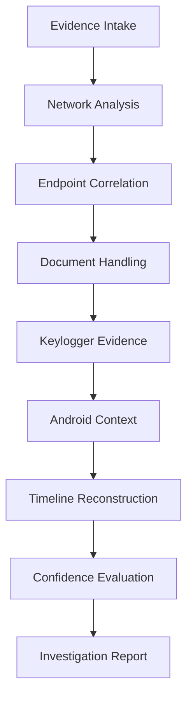
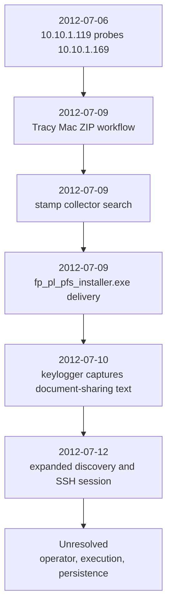

<!-- markdownlint-disable MD013 -->

# National Gallery DC 2012 Attack: C.O.N.N.O.R. Investigation Series - McCloud Platform

> **Case:** Digital Corpora Case 002 - National Gallery DC 2012 Attack
>
> **Difficulty:** Intermediate
>
> **Focus Areas:** Network Forensics, Endpoint Forensics, Android Artifacts, Keylogger Evidence, Timeline Reconstruction, Evidence Confidence Handling
>
> **Authoring Style:** Evidence-Based DFIR Investigation
>
> **Version:** 1.1
>
> **Revision Focus:** Readability, investigative flow, publication polish, and methodology clarification. Investigative conclusions unchanged.

## Executive Summary

| Category | Finding |
| --- | --- |
| **Repeated Targeting** | `10.10.1.119` repeatedly probed `10.10.1.169` across multiple days and expanded into broader discovery activity by July 12. |
| **Confirmed Delivery** | `10.10.1.169` and its strongly supported interior counterpart `192.168.1.101` downloaded `fp_pl_pfs_installer.exe` from `download.macromedia.com` on 2012-07-09. |
| **Browser Attribution** | Recovered browser artifacts strongly tie the Windows browsing environment to Tracy TeeSumTwelve's Google-account context. |
| **Document Handling** | Tracy's MacBook Air directly preserves password-protected ZIP creation, sent attachments, and typed document-sharing activity involving `Stamp insurance` PDFs. |
| **Keylogger Evidence** | Joe-side keylogger exfiltration from Tracy's MacBook Air is directly supported by the recovered email dump. |
| **Planning Context** | Carry's tablet materially corroborates organizer-side planning, communication, and file-sharing context involving Alex, Tracy, and related identities. |
| **Remaining Limits** | The case does not prove Flash installer execution, persistence, or who operated the July 12 SSH session between `10.10.1.13` and `10.10.1.169`. |

This investigation supports two overlapping storylines. First, **Repeated Targeting** and **Confirmed Delivery** are well supported by the network evidence: the Windows endpoint represented externally as `10.10.1.169` was repeatedly targeted by `10.10.1.119`, and that same endpoint confirmedly downloaded `fp_pl_pfs_installer.exe` from `download.macromedia.com` on 2012-07-09. Second, Tracy's MacBook Air, the keylogger email dump, and Carry's tablet preserve a separate but related record of document handling, planning, and interpersonal coordination around the broader National Gallery scenario.

The evidence is strongest when it stays narrow. **Browser Attribution** is strongly supported, **Keylogger Evidence** is directly supported, and the July 12 SSH session is real. **Remaining Limits** are equally important: the current artifact set does not identify the SSH operator, prove illegitimacy, or show that the Flash installer executed or established persistence.

## Investigation Philosophy

This walkthrough intentionally distinguishes between:

- Directly Proven
- Strongly Supported
- Reconstructed
- Unresolved

The purpose is to preserve the difference between observed evidence and analytical inference. That matters in this case because several of the most interesting questions are not answered by one artifact alone.

This writeup is public-safe and spoiler-aware. It explains the investigative path and the reasoning behind the conclusions without exposing raw evidence, full logs, private local filesystem paths, or unnecessary workstation details.

## Table Of Contents

- [Investigation Philosophy](#investigation-philosophy)
- [Introduction](#introduction)
- [Spoiler Notice](#spoiler-notice)
- [Learning Objectives](#learning-objectives)
- [Scope And Evidence](#scope-and-evidence)
- [Tools And Artifacts Used](#tools-and-artifacts-used)
- [Methodology](#methodology)
- [Timeline And Timezone Handling](#timeline-and-timezone-handling)
- [Network Analysis](#network-analysis)
- [Endpoint And Communication Analysis](#endpoint-and-communication-analysis)
- [Keylogger And Document Handling](#keylogger-and-document-handling)
- [Android Device Findings](#android-device-findings)
- [SSH And Attribution Limits](#ssh-and-attribution-limits)
- [Answers To The Case Questions](#answers-to-the-case-questions)
- [Score And Lessons Learned](#score-and-lessons-learned)
- [Investigation Summary](#investigation-summary)
- [Conclusion](#conclusion)
- [Public-Safety Review Checklist](#public-safety-review-checklist)
- [Attribution](#attribution)

## Attack Flow Diagram



## Introduction

This walkthrough covers Digital Corpora Case 002, the National Gallery DC 2012 Attack, as an evidence-based DFIR investigation written for public study.

Original scenario page: [Digital Corpora - 2012 National Gallery DC Attack](https://digitalcorpora.org/corpora/scenarios/national-gallery-dc-2012-attack/)

Scenario archive root: [Digital Corpora NGDC scenario archive](https://downloads.digitalcorpora.org/corpora/scenarios/2012-ngdc/)

Referenced scenario shape for study order and article framing:

- official scenario overview and persona descriptions on the Digital Corpora page
- seized-evidence inventory from the published NGDC scenario materials
- artifact-led reconstruction using the preserved network, endpoint, mobile, and keylogger evidence

The case is interesting because it combines several different artifact families that point in related directions without collapsing into one simplistic answer. The network evidence shows repeated targeting and a confirmed executable delivery. The Mac and email artifacts show document handling and keylogged typed activity. The Android evidence adds planning and communication context. The hardest questions are not about whether suspicious activity exists, but about how far the current evidence can responsibly go.

That is why the writeup emphasizes confidence handling. A good investigation here is not the loudest theory. It is the most defensible separation between what the artifacts prove, what they strongly support, what they only reconstruct, and what remains unresolved.

The scenario mixes two different goals:

- build a defensible investigative narrative from the preserved artifacts
- answer the case questions cleanly without overstating what the current evidence proves

That split matters. A technically interesting scenario can still produce a weak writeup if direct observations, reconstructions, and unresolved questions are not kept separate.

> [!IMPORTANT]
> **Key Takeaway**
> This writeup is structured to do two jobs at once: preserve a defensible investigative narrative and answer the scenario cleanly. The sections that follow keep those goals aligned without overstating the evidence.

## Spoiler Notice

This writeup contains spoilers for the full investigation, including the repeated targeting pattern, the confirmed Flash installer delivery, the Tracy-linked browser context, the keylogger evidence, and the July 12 SSH activity.

If you want to work the scenario first, stop here and return only after you have formed your own timeline and confidence judgments.

## Learning Objectives

By the end of this walkthrough, an analyst should be able to:

- separate confirmed delivery from unproven execution
- use paired interior and exterior network evidence to support NAT-side host mapping
- distinguish Tracy-side document handling from Carry-side planning activity
- explain why keylogger evidence can materially strengthen a case narrative without answering every attribution question
- normalize artifact-local, scenario-local, and UTC timestamps without forcing false precision
- preserve unresolved operator-attribution questions instead of over-claiming compromise

> [!IMPORTANT]
> **Key Takeaway**
> The investigative value in this case came from disciplined pivots, careful timeline handling, and explicit confidence boundaries. Those themes drive every section that follows.

## Scope And Evidence

Artifact categories reviewed in this investigation:

- exterior and interior network captures for July 6, July 9, and July 10
- July 12 network text logs
- Tracy home and external disk images
- Tracy Android phone extraction content
- Carry Android tablet image
- emailed keylogger log dump
- scenario and identity notes used only as bounded context

Sanitized relative examples of reviewed material:

- `case/evidence/ngdc-exterior-2012-07-09.pcap`
- `case/evidence/ngdc-interior-2012-07-09.pcap`
- `case/evidence/tracy-home-2012-07-16-final.E01`
- `case/evidence/tracy-external-2012-07-16-final.E01`
- `case/evidence/carry-tablet-2012-07-16-final.E01`
- `case/evidence/zip-dumps/email/*.eml`
- `case/exports/...`
- `case/notes/...`

This public writeup does not include raw packet payloads, full recovered web objects, full email bodies, private local workstation paths, or the archived case working tree.

> [!IMPORTANT]
> **Key Takeaway**
> The writeup is evidence-led but intentionally sanitized for public release. It preserves the investigative logic without exposing raw case material.

## Tools And Artifacts Used

Primary artifact lanes and outputs used during the investigation:

- PCAP reduction and Zeek-style connection and HTTP review
- recovered HTTP object review for browser-context attribution
- disk and virtual-machine artifact review for Tracy's Mac and Windows guest state
- Android app-database review for Gmail, browser, contacts, and communication context
- email dump review for keylogger exfiltration and typed-user-activity evidence
- tracker-driven confidence handling to separate proven, reconstructed, and unresolved findings

Representative workflow patterns:

```bash
analyze-current-pcap.sh <capture>
generate-current-report.sh --case <case>
review endpoint artifacts against the evidence-to-answer tracker
```

The exact operator commands are intentionally not reproduced here in full because this writeup is about the investigative reasoning, not the private case environment.

> [!IMPORTANT]
> **Key Takeaway**
> The toolset was broad, but each artifact lane served a specific pivot purpose: network reduction, endpoint correlation, communication reconstruction, or confidence bounding.

## Methodology

### Analysis Order

This investigation was worked in this order:

1. preserve and inventory the evidence
2. triage the network captures
3. correlate paired interior and exterior activity
4. test candidate endpoints against the network fingerprint
5. pivot into keylogger and communication evidence
6. use Android artifacts to map planning context
7. normalize the timeline and bound unresolved conclusions

### Corroboration Rule

Each artifact was initially treated as independent evidence until corroborated by another source. Network observations, endpoint residue, typed-user-activity evidence, and mobile communications were only promoted when they aligned cleanly enough to support the same conclusion without collapsing inference into observation.

### Why Network Triage Came First

The packet captures provided the fastest discriminating surface. They immediately exposed:

- a repeated probing source, `10.10.1.119`
- a repeated target, `10.10.1.169`
- a concrete delivery event, `fp_pl_pfs_installer.exe`
- a later SSH conversation involving `10.10.1.13`

That made the next question sharper. Instead of asking whether any endpoint might be suspicious, the investigation could ask which endpoint best matched the Windows browser activity, what human context surrounded it, and whether the later SSH session belonged to the same storyline.

### Confidence Discipline

This case is a good example of why negative findings must stay bounded. The mounted Windows guest did not prove Flash execution. That does not mean the installer never executed anywhere. The July 12 SSH session is real. That does not mean the current evidence identifies the operator or proves it was unauthorized. The writeup keeps those limits explicit throughout.

> [!IMPORTANT]
> **Key Takeaway**
> The investigative flow was deliberate: start with the fastest artifact for pivots, then move lane by lane to confirm, constrain, and explain. That sequencing is a major reason the final conclusions stayed defensible.

## Timeline And Timezone Handling

The case mixes multiple time bases:

- UTC-style network timestamps in the packet analysis
- host-local Mac and guest timestamps
- Android artifact-local timestamps
- July 12 text-log times with limited inline timezone context

The safest approach is to preserve each artifact family in its own time basis unless correlation is strong enough to justify normalization.

### Timeline Overview



### Key Chronology

- **2012-07-06:** `10.10.1.119` repeatedly probed `10.10.1.169` across multiple ports. A separate `10.10.1.13 -> 10.10.1.169:22` connection also appeared.
- **2012-07-09:** Tracy's MacBook Air created and handled password-protected ZIP archives containing `Stamp insurance` documents.
- **2012-07-09:** The Windows host behind `192.168.1.101` searched for `stamp collector pricing guide` and later downloaded `fp_pl_pfs_installer.exe` from `download.macromedia.com`.
- **2012-07-10:** Keylogger emails captured typed text about sending documents and a password to Perry, plus helping a tablet get inside.
- **2012-07-12:** The targeting pattern broadened into ARP, NetBIOS, and SNMP activity, and a payload-bearing SSH session appeared between `10.10.1.13` and `10.10.1.169`.

> [!IMPORTANT]
> **Key Takeaway**
> Timeline work in this case depended on preserving time-source boundaries instead of forcing false normalization. The safest narrative is the one that states where precision ends.

## Network Analysis

### Network Findings - Directly Proven

- `10.10.1.119` repeatedly probed `10.10.1.169` across multiple days.
- `10.10.1.169` downloaded `fp_pl_pfs_installer.exe` from `download.macromedia.com` on 2012-07-09.
- The paired interior capture strongly aligns the same event to `192.168.1.101`.
- The July 12 logs preserve a real payload-bearing SSH session between `10.10.1.13` and `10.10.1.169`.

### Network Findings - Strongly Supported

- `10.10.1.169` is the NAT-side representation of interior host `192.168.1.101`.
- The Windows browser activity on July 9 and July 10 belongs to the same user environment later tied to Tracy's Google-account context.

### Network Findings - Reconstructed

- The July 12 SSH lane appears separate from the repeated `10.10.1.119` probing lane because the observed peer is `10.10.1.13`, not the scanning source.

### Network Findings - Unresolved

- The network evidence does not prove `fp_pl_pfs_installer.exe` executed.
- It does not prove persistence, callback behavior, or successful compromise caused by that file.
- It does not identify the operator of `10.10.1.13` or the legitimacy of the July 12 SSH session.

The most important network lesson is that confirmed delivery is not the same as confirmed execution. The captures prove a meaningful event, but the later host-side question remains open.

## Endpoint And Communication Analysis

The endpoint picture becomes clearer when each artifact family is allowed to answer only the question it is actually good at answering. That discipline is what keeps the browser, Mac, mobile, and keylogger lanes complementary instead of contradictory.

### Windows Browser Attribution

Recovered July 9 YouTube and July 10 Gmail web objects strongly tie the Windows browser environment to Tracy TeeSumTwelve and `tracysumtwelve@gmail.com`. That is not the same as proving exclusive system ownership, but it materially narrows the user context behind `192.168.1.101` / `10.10.1.169`.

The browser activity also fits the document storyline. A search for `stamp collector pricing guide` occurred shortly before the confirmed executable delivery, which aligns with the later `Stamp insurance` handling seen elsewhere in the case.

### Tracy's Windows Guest Limits

The mounted Tracy Windows guest does not prove Flash execution. No Firefox installation, no direct Flash residue, and no clear SSH tooling were recovered in the bounded review of that guest. The visible activity there centered on Thunderbird and ZIP archives rather than browser installation or SSH use.

That negative result matters, but only narrowly. It weakens the fit between that specific guest and the network fingerprint. It does not prove the installer never executed on another endpoint or another guest state.

### Mac Host Context

Tracy's Mac host preserves the strongest local proof of document handling. It shows ZIP creation, sent-mail attachment handling, and VirtualBox history that suggests more than one relevant Windows guest state may have existed over time. The disk evidence also preserves a `VBoxManage clonehd` command involving a separate `TRACY` volume, which strengthens the idea that the acquired guest is not the whole VM story.

## Keylogger And Document Handling

This is one of the strongest lanes in the case.

### Keylogger Findings - Directly Proven

- The email dump README and sampled `.eml` files directly support that keylogger logs from Tracy's MacBook Air were periodically emailed to Joe.
- The logs directly capture Tracy typing commands to create password-protected ZIP archives.
- The logs directly capture typed text about sending documents and the password to Perry.
- The logs directly capture typed language about helping get a tablet inside and arranging when someone could look around.

### Why That Matters

Without the keylogger, the document storyline would rest more heavily on timestamps, filenames, and surrounding communications. With the keylogger, the case has typed-user-activity evidence showing the document-sharing and access-facilitation language in Tracy's own workflow context.

### Limits

This lane still does not prove the July 9 Flash installer executed, and it does not tie Joe's keylogger directly to the repeated `10.10.1.119` probing. It is extremely strong for human activity on the Mac, but it answers a different question than the network lane.

## Android Device Findings

### Carry's Tablet

Carry's tablet is materially relevant because it preserves a richer planning and communication timeline than the Tracy phone. Its recovered Gmail and contacts data support Carry's relationship with Alex and Tracy, plus planning and file-sharing context around the July 6 to July 13 window.

This is best understood as organizer-side context. It supports the broader scenario narrative and helps explain how people and plans connect, but it does not act as a stand-in for the Windows endpoint behind `10.10.1.169`.

### Tracy's Phone

The recovered Android phone content adds communication context involving files, Dropbox, a tablet, and exchanges with `alex.jfam11@gmail.com`, but it does not match the July 9 Windows browser and Flash-delivery fingerprint. Its value is contextual, not dispositive for the Windows network activity.

### Confidence View

- **Directly Proven:** Carry's tablet and Tracy's phone both preserve relevant communication artifacts.
- **Strongly Supported:** Carry's tablet is the richer planning device and materially corroborates organizer-side activity.
- **Unresolved:** Neither Android device directly proves execution of `fp_pl_pfs_installer.exe` or explains the July 12 SSH session.

## SSH And Attribution Limits

The July 12 SSH session is one of the most important places to resist over-claiming.

### SSH Findings - Directly Proven

- A payload-bearing SSH session occurred between `10.10.1.13` and `10.10.1.169`.
- A similar `10.10.1.13 -> 10.10.1.169:22` event also appeared on July 6.

### SSH Findings - Strongly Supported

- The SSH activity appears separate from the repeated `10.10.1.119` multi-port probing lane.

### SSH Findings - Unresolved

- Who operated `10.10.1.13`.
- Whether the session was authorized administration or unauthorized access.
- Whether any recovered Tracy-side endpoint was the actual system state responsible for the SSH behavior.

The strongest public-safe conclusion is not that the SSH session was malicious. It is that the session was real, materially relevant, and not attributable from the current artifact set.

## Answers To The Case Questions

### 1. Who are the main people and roles visible in the case?

Tracy is the strongest insider-side figure, Carry is the clearest organizer-side figure, Alex appears as the upstream ideological or planning contact, Joe is directly tied to keylogger exfiltration, and Perry appears in the document-sharing storyline.

### 2. What are the main technical storylines?

The first is repeated network targeting and confirmed executable delivery to a Tracy-linked Windows browsing environment. The second is Tracy-side document handling and Carry-side planning activity preserved across Mac, Android, and keylogger artifacts.

### 3. What best proves suspicious targeting?

The repeated multi-day `10.10.1.119 -> 10.10.1.169` probing pattern plus the confirmed July 9 delivery of `fp_pl_pfs_installer.exe`.

### 4. What best ties the Windows endpoint to a user context?

Recovered browser artifacts that show Tracy TeeSumTwelve and `tracysumtwelve@gmail.com` in the Windows browsing environment.

### 5. What best proves document-sharing activity?

Tracy's Mac ZIP artifacts plus the keylogger-captured typed text about sending documents and a password to Perry.

### 6. Why does Joe's keylogger matter so much?

Because it turns suspicious context into direct typed-user-activity evidence and directly supports exfiltration of those logs to Joe.

### 7. What does Carry's tablet contribute?

It materially corroborates planning, communication, and file-sharing context involving Alex, Tracy, and related identities.

### 8. Does the case prove the Flash installer executed?

No. Delivery is directly proven, but execution and persistence remain unresolved.

### 9. Does the case identify the SSH operator?

No. The SSH session is real, but operator attribution remains unresolved.

### 10. Does the case prove that Tracy knew the full criminal objective?

Not completely. The artifacts strongly support suspicious assistance and document handling, but the hardest knowledge and intent questions still require caution.

### 11. Which dates matter most?

July 6 establishes early probing and the recurring `10.10.1.13` SSH peer. July 9 is the densest technical date because it contains the ZIP workflow, the browser search, and the confirmed executable delivery. July 10 adds keylogger-captured document-sharing language. July 12 adds the expanded discovery activity and the payload-bearing SSH session.

### 12. What suggests Carry is more technically organized?

Carry's tablet preserves the richer planning and file-sharing context, broader Alex-linked communication, and a more obvious organizer-side role. That supports higher technical and operational organization, even if the strongest explicit claims still depend partly on combined-artifact reconstruction.

### 13. What would be needed to prove Tracy knowingly participated in a crime?

The missing discriminator is a direct statement or equivalent artifact showing that Tracy knew the real downstream objective, not just that she handled suspicious documents or access-related requests. A message, note, payment trail, or explicit instruction acknowledging the criminal purpose would materially strengthen that point.

### 14. What supports or weakens the flash-mob explanation?

It is weakened by the typed password-sharing language, the `Stamp insurance` ZIP workflow, the valuation-related browser activity, and the access-facilitation language about getting a tablet inside. It is not fully eliminated because the current evidence still does not contain a single explicit artifact where Tracy states she knows the complete criminal objective.

### 15. What are the five most important facts for a law-enforcement summary?

1. `10.10.1.119` repeatedly targeted `10.10.1.169` across multiple days.
2. `10.10.1.169` / `192.168.1.101` confirmedly downloaded `fp_pl_pfs_installer.exe` from `download.macromedia.com` on 2012-07-09.
3. Recovered browser artifacts strongly tie that Windows environment to Tracy's Google-account context.
4. Tracy's Mac and the keylogger emails directly prove document-packaging and document-sharing activity, and directly support exfiltration of Mac keystroke logs to Joe.
5. The July 12 SSH session is real, but the case does not yet prove who operated it or whether the Flash installer executed or persisted.

## Score And Lessons Learned

### What This Investigation Did Well

- It preserved evidence confidence levels instead of flattening everything into one theory.
- It used the network lane to create efficient endpoint pivots.
- It treated keylogger evidence as high-value direct proof instead of as background noise.
- It resisted turning the July 12 SSH session into a stronger claim than the artifacts support.

### Where The Case Stays Hard

- The confirmed executable delivery invites over-claiming about execution.
- The mounted Windows guest is informative but not necessarily complete.
- The people-and-plans storyline is richer than the technical-attribution storyline.

### Practical Lessons

1. Confirmed download does not equal confirmed execution.
2. A strong user-context attribution can still fall short of operator attribution.
3. Keylogger evidence can dramatically narrow a human-activity question without answering a network-operator question.
4. Bounded negatives are often more valuable than dramatic but weak theories.

## Investigation Summary

This investigation directly proves repeated targeting of `10.10.1.169`, directly proves delivery of `fp_pl_pfs_installer.exe`, directly proves keylogger exfiltration from Tracy's MacBook Air, and directly proves Tracy-side typed document-sharing and access-facilitation language. It also strongly supports the conclusion that the Windows browsing environment belonged to Tracy's Google-account context and that Carry's tablet preserves organizer-side planning and communication context.

The remaining limits are equally important. The current evidence does not prove Flash-installer execution, does not prove persistence, does not prove that the bounded Tracy Windows guest was the exact endpoint responsible for the observed browser activity, and does not identify the operator or legitimacy of the July 12 SSH session.

That mix of strong proof and explicit uncertainty is the real teaching value of the case.

## Conclusion

The National Gallery DC 2012 Attack scenario is most defensible when written as a layered investigation rather than as a single neat compromise story.

The network evidence proves repeated targeting and confirmed executable delivery. The browser artifacts strongly tie that activity to Tracy's Google-account context. Tracy's Mac and the keylogger emails directly prove document-packaging and document-sharing behavior. Carry's tablet materially corroborates planning and communication context across the same broader window.

At the same time, the current evidence stops short of proving Flash execution, persistence, or SSH operator attribution. Those limits are not weaknesses in the investigation. They are the correct boundaries of the preserved artifacts.

The most defensible report is the one that leaves uncertainty visible when corroboration stops.

## Public-Safety Review Checklist

- [x] No raw packet payloads reproduced
- [x] No full keylogger logs reproduced
- [x] No private workstation-only filesystem paths exposed
- [x] No archived case record modified
- [x] No unsupported attribution claim promoted to fact
- [x] Execution, persistence, and operator-attribution limits kept explicit
- [x] Spoiler notice included near the top of the walkthrough

## Attribution

This writeup is based on the preserved artifacts and derived report outputs from Digital Corpora Case 002 - National Gallery DC 2012 Attack, rewritten as a public-safe DFIR walkthrough in the C.O.N.N.O.R. Investigation Series - McCloud Platform style.

The conclusions here are evidence-based and confidence-aware. Where the current artifact set stops short of proving a claim, the writeup keeps that claim unresolved rather than presenting inference as observation.
